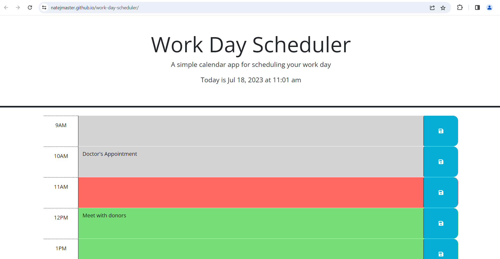

# work-day-scheduler
Challenge Description: Developers were provided starter code to a website with an organized and intentionally styled html and css framework. To meet acceptance criteria, the framework in place would need to be updated through JavaScript interactions to create a schedule that responds to the current date or time and changes its styling depending on whether the current hour is in the past, present, or future in relation to the current time. Additionally, in each hour of the schedule, the user should be able to enter data that can be saved to localStorage with a buttonclick and will persist after a page refresh.

Skills Displayed: Meeting the acceptance criteria involved displaying a mastery of third party APIs. Not only did many portions of the JS code utilize more convenient code established in jQuery, but also any references to current date and current time utilized a link with the dayJS API. Beyond this, developer skills showcased in this challenge were the iteration of for loops to create unique data containers, attribute declaration through a series of "if, else if" statements to ensure correct classification. Finally, developers were required to display a knowledge of event listeners (specifically enacting upon buttons generated by earlier JavaScript) and a strong understanding of both storing in and calling from localStorage.

Link to deployed application: https://natejmaster.github.io/work-day-scheduler/

